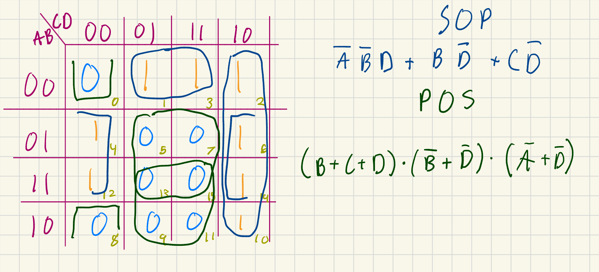

# Lab 04 - SOP/POS and KMaps

In this lab, you’ve learned how to apply KMaps, Sum Of Products and Products of
sums to simplify digital logic equations. Then, you’ve proven out that they work
using an implemented design on your Basys3 boards.

## Rubric

| Item | Description | Value |
| ---- | ----------- | ----- |
| Summary Answers | Your writings about what you learned in this lab. | 25% |
| Question 1 | Your answers to the question | 25% |
| Question 2 | Your answers to the question | 25% |
| Question 3 | Your answers to the question | 25% |

## Lab Summary

Authors: Gage Munt and Nathan Kovaleski 
Group: 18

In this lab we learned the value of K-Mapping in increasing circuit efficiency and the speed of making said circuit. To accomplish this we used SOP (Sum Of Products) and POS (Product Of Sums) on the K-map to instantly find the most simplified boolean algebra statement. 

Our K-Map:

## Lab Questions

### Why are the groups of 1’s (or 0’s) that we select in the KMap able to go across edges?

We are able to group the 1's and 0's around the edges of the table because only one variable changes state (from 1 to 0). Otherwise we would be left with a single element that would require a full expression to represent (ex: ABCD) 

### Why are the names Sum of Products and Products of Sums?

With the idea that `+` is `OR` and `*` is `AND` the Sum of Products is literally a series/group of multiple products (ABC, BCD, etc) all `OR` together through the `+` signs. The same concept applies for the Product of Sums where instead it is groups of `OR`ed values (A + B + C) multiplied (`AND`) together. 

### Open the test.v file – how are we able to check that the signals match using XOR?

We can use `XOR` for test case conditions because we are verifying that there is no difference between the truth table and our simplified expressions. If the SOP showed `1` when the truth table showed `0`, it would return false (`0`) meaning the test failed.
